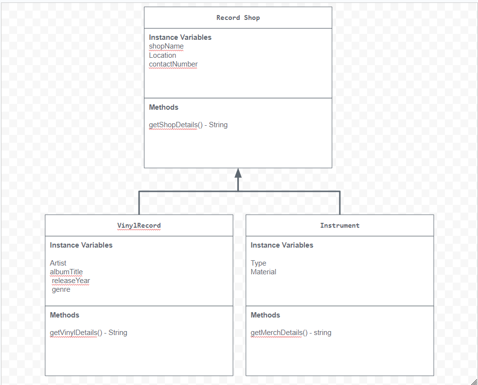

# Unit 2 - Store Management Project

## Introduction

You are opening a new business in your community! Businesses often need programs to manage the products and services they offer and track orders and requests from customers. Your goal is to create a store management system for your business.

## Requirements

Use your knowledge of object-oriented programming and class structure and design to create your store management system:
- **Create a class hierarchy** – Develop a superclass that represents a product or service your business offers and one or more subclasses that extend the superclass to represent more specific types of products or services.
- **Declare instance variables** – Declare instance variables in the superclass that are shared with the subclasses and instance variables in the subclasses that are not shared with the superclass.
- **Write constructors** – Write no-argument and parameterized constructors in the superclass and subclasses. Subclass constructors use the super keyword to call the superclass constructor.
- **Implement accessor and mutator methods** – Write accessor and mutator methods for instance variables that should be accessible and/or modifiable from outside of the class.
- **Implement a toString() method** – Write toString() methods in the superclass and subclasses that return information about the state of an object.

## UML Diagram

## Description

The project I created is a record/music store that sells music and instruments. I chose this because I have a passion for music and instruments. I play the piano and I used to take lessons in elementry school but had to quit due to covid and I have hundreds to a thousand of hours on spotify. In my store management system, I implemented an object-oriented structure by creating a RecordShop class as the superclass, which includes common attributes like name, description, and price. The Instrument subclass inherits from RecordShop and adds specific features such as type and material. I used constructors to initialize the objects, and accessor/mutator methods getters for managing data. To interact with the store, users can input instrument details, which are captured using the Scanner class. The system then displays the item information by overriding the toString method.